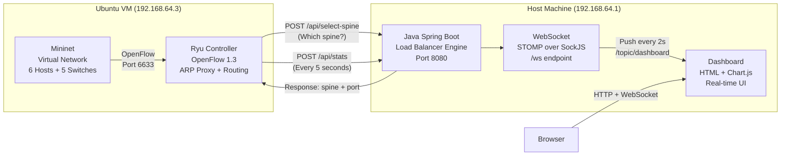
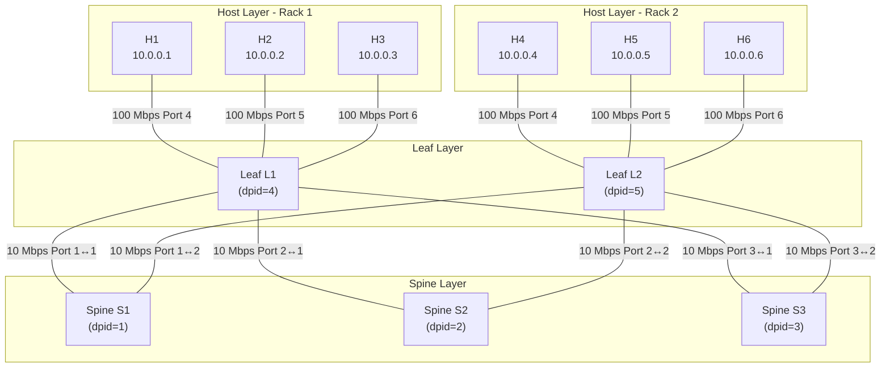
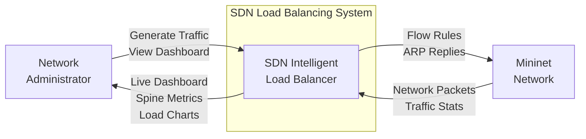
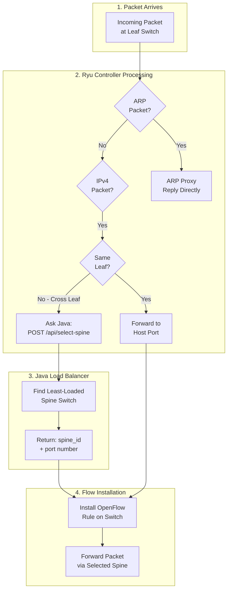
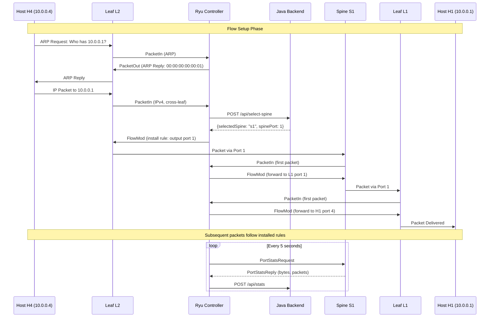
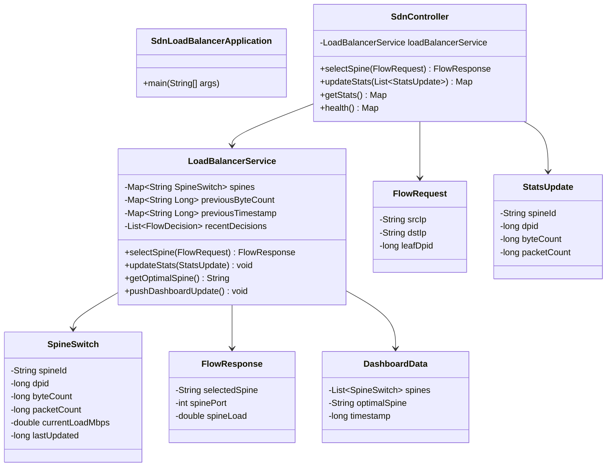
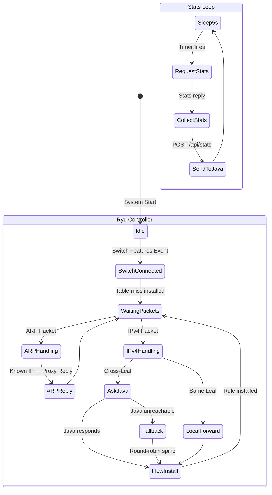
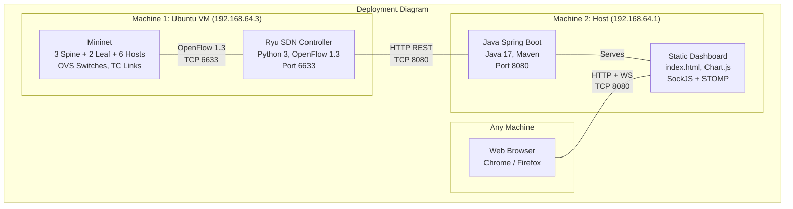

# SDN INTELLIGENT LOAD BALANCING IN LEAF-SPINE DATA CENTER NETWORKS

### A Project Report

---

## INDEX

| **CONTENTS** | **PAGE** |
|---|---|
| List of Figures | vii |
| List of Abbreviations | ix |
| **1. INTRODUCTION** | **1** |
| 1.1 Introduction | 1 |
| 1.2 Problem Statement | 2 |
| 1.3 Project Objective | 2 |
| 1.4 Project Scope | 3 |
| 1.5 Technology Stack | 3-4 |
| 1.6 Development Process | 5-6 |
| **2. LITERATURE SURVEY** | **7** |
| 2.1 Software Defined Networking (SDN) | 7 |
| 2.2 Leaf-Spine Architecture | 7 |
| 2.3 OpenFlow Protocol | 8 |
| 2.4 Load Balancing in Data Centers | 8 |
| **3. SOFTWARE REQUIREMENT ANALYSIS** | **9** |
| 3.1 Problems | 9 |
| 3.2 Modules and Functionalities | 10 |
| **4. SOFTWARE DESIGN** | **11** |
| 4.1 System Architecture | 11 |
| 4.2 Network Topology Diagram | 12 |
| 4.3 Dataflow Diagrams | 13-14 |
| 4.4 Sequence Diagram | 15 |
| 4.5 Class Diagram | 16 |
| 4.6 State Diagram | 17 |
| 4.7 Deployment Diagram | 18 |
| **5. SOFTWARE REQUIREMENTS** | **19** |
| 5.1 Hardware Requirements | 19 |
| 5.2 Software Requirements | 19 |
| **6. MODULES** | **20** |
| 6.1 Ryu SDN Controller Module | 20 |
| 6.2 Java Load Balancer Module | 20 |
| 6.3 Live Dashboard Module | 21 |
| 6.4 Mininet Network Module | 21 |
| 6.5 Stats Collection Module | 21 |
| **7. CODING TEMPLATES** | **22-27** |
| **8. TESTING AND VALIDATION** | **28-29** |
| 8.1 Software Testing | 28 |
| 8.2 Types of Testing | 29 |
| **9. OUTPUT SCREENS** | **30-34** |
| **10. CONCLUSION** | **35** |
| **11. FUTURE ENHANCEMENTS** | **36** |
| **12. REFERENCES** | **37** |

---

## List of Figures

| **Figure No.** | **Title** | **Page** |
|---|---|---|
| Fig 1.1 | Leaf-Spine Network Topology | 12 |
| Fig 4.1 | System Architecture Diagram | 11 |
| Fig 4.2 | Network Topology Diagram | 12 |
| Fig 4.3 | DFD Level 0 — Context Diagram | 13 |
| Fig 4.4 | DFD Level 1 — Detailed Data Flow | 14 |
| Fig 4.5 | Sequence Diagram — Flow Setup & Stats | 15 |
| Fig 4.6 | Class Diagram — Java Backend | 16 |
| Fig 4.7 | State Diagram — Ryu Controller Lifecycle | 17 |
| Fig 4.8 | Deployment Diagram | 18 |
| Fig 9.1 | Dashboard — Idle State | 30 |
| Fig 9.2 | Dashboard — Single Flow Active | 31 |
| Fig 9.3 | Dashboard — All 3 Spines Loaded | 32 |
| Fig 9.4 | Ryu Controller Terminal Output | 33 |
| Fig 9.5 | Java Backend Terminal Output | 34 |

---

## List of Abbreviations

| **Abbreviation** | **Full Form** |
|---|---|
| SDN | Software Defined Networking |
| API | Application Programming Interface |
| ARP | Address Resolution Protocol |
| DPID | Datapath Identifier |
| DFD | Data Flow Diagram |
| HTTP | Hypertext Transfer Protocol |
| IP | Internet Protocol |
| JSON | JavaScript Object Notation |
| LB | Load Balancer |
| MAC | Media Access Control |
| Mbps | Megabits Per Second |
| OVS | Open vSwitch |
| REST | Representational State Transfer |
| TCP | Transmission Control Protocol |
| UML | Unified Modeling Language |
| VM | Virtual Machine |
| WS | WebSocket |

---

## CHAPTER 1: INTRODUCTION

### 1.1 Introduction

Modern data centers rely on efficient network fabrics to handle massive east-west traffic between servers. The **Leaf-Spine architecture** has become the industry standard for data center networks, replacing traditional three-tier designs. In a Leaf-Spine topology, every leaf switch connects to every spine switch, providing multiple equal-cost paths between any two servers.

However, having multiple paths creates a challenge: **how to distribute traffic evenly across all spine switches**. Traditional approaches like Equal-Cost Multi-Path (ECMP) use static hashing, which can lead to uneven load distribution — a problem known as **hash polarization**. When multiple flows hash to the same spine, that spine becomes congested while others remain underutilized.

This project implements an **Intelligent Load Balancing system** using Software Defined Networking (SDN). A centralized Java application makes real-time routing decisions based on actual traffic load on each spine switch. Unlike static hashing, this approach dynamically selects the least-loaded spine for each new flow, achieving near-optimal traffic distribution.

The system consists of three components:
1. **Ryu SDN Controller** (Python) — Intercepts network packets via OpenFlow and manages flow rules on switches
2. **Java Spring Boot Backend** — Intelligent load balancing engine that makes spine selection decisions and calculates traffic rates
3. **Live Web Dashboard** — Real-time visualization of spine loads, traffic distribution, and load balancing decisions

### 1.2 Problem Statement

In conventional leaf-spine data center networks, traffic distribution across spine switches is handled by static hashing algorithms (ECMP). These algorithms suffer from:

- **Hash Polarization**: Multiple flows map to the same spine, causing congestion on one path while others are idle
- **No Load Awareness**: Routing decisions are made without knowledge of current traffic conditions
- **No Visibility**: Network administrators have no real-time view of traffic distribution across spines
- **No Adaptability**: Once a flow is assigned to a spine, it cannot be redistributed even if conditions change

There is a need for an intelligent, load-aware routing system that can dynamically distribute traffic across all available spine paths based on real-time load metrics.

### 1.3 Project Objective

The primary objectives of this project are:

1. **Implement intelligent load balancing** that distributes flows across spine switches based on real-time traffic load (least-loaded selection)
2. **Build an ARP Proxy** to eliminate broadcast storms in the leaf-spine fabric
3. **Implement flood safety** to prevent traffic loops by restricting flooding to host ports only
4. **Provide a live dashboard** with real-time visualization of spine loads, traffic rates, and load balancing decisions
5. **Ensure fault tolerance** with automatic fallback to round-robin routing if the Java backend is unreachable
6. **Demonstrate measurable improvement** over static routing by showing even traffic distribution across all 3 spines

### 1.4 Project Scope

The project scope includes:

- A Mininet-based leaf-spine network simulation with 3 spine switches, 2 leaf switches, and 6 hosts
- A Ryu OpenFlow controller with ARP proxy, flood safety, and Java integration
- A Java Spring Boot backend with REST API for spine selection and stats collection
- A web-based real-time dashboard with live charts using WebSocket
- Traffic generation using iperf to demonstrate load balancing
- Bandwidth-limited links (10 Mbps spine links, 100 Mbps host links) to make load visible

The project does **not** include:
- Production deployment on physical switches
- Flow re-routing (once a flow is assigned, it stays until idle timeout)
- Authentication or security for the REST API
- Persistent storage of historical data

### 1.5 Technology Stack

| **Component** | **Technology** | **Version** | **Purpose** |
|---|---|---|---|
| SDN Controller | Ryu | 4.34+ | OpenFlow packet processing, ARP proxy, flow rule management |
| Network Simulator | Mininet | 2.3.0+ | Virtual network with OVS switches and virtual hosts |
| OpenFlow Protocol | OpenFlow | 1.3 | Communication between switches and controller |
| Backend Framework | Spring Boot | 3.2.0 | REST API, WebSocket, load balancing engine |
| Programming Language | Java | 17+ | Backend load balancer logic |
| Programming Language | Python | 3.8+ | Ryu controller |
| Build Tool | Maven | 3.8+ | Java dependency management and build |
| Frontend | HTML5, CSS3, JavaScript | — | Dashboard UI |
| Charting Library | Chart.js | 4.4.0 | Real-time line charts |
| WebSocket | STOMP over SockJS | — | Live data push to browser |
| Virtual Switches | Open vSwitch (OVS) | 2.13+ | Software OpenFlow switches in Mininet |
| Traffic Generator | iperf | 2.x | Generate TCP/UDP traffic between hosts |
| HTTP Client | Python requests | 2.28+ | Ryu → Java HTTP communication |

**Why These Technologies?**

- **Ryu** was chosen because it is a lightweight, Python-based SDN controller with excellent OpenFlow 1.3 support and is widely used in academic SDN research.
- **Spring Boot** provides a production-ready framework with built-in WebSocket and REST support, making it ideal for the backend decision engine.
- **Mininet** enables rapid prototyping of network topologies without physical hardware.
- **Chart.js** provides responsive, animated charts with minimal code for the real-time dashboard.

### 1.6 Development Process

The project followed an **iterative development process** with the following phases:

**Phase 1: Network Design**
- Designed the leaf-spine topology (3 spines, 2 leaves, 6 hosts)
- Defined port mappings, DPID assignments, and IP/MAC allocations
- Created the Mininet topology script with bandwidth-limited links

**Phase 2: SDN Controller Development**
- Implemented basic L2 learning switch in Ryu
- Added ARP Proxy to eliminate broadcast storms
- Added flood safety (host-port-only flooding)
- Integrated Java backend communication via REST API

**Phase 3: Load Balancer Backend**
- Built Spring Boot REST API with spine selection endpoint
- Implemented least-loaded spine selection algorithm
- Added stats ingestion and rate calculation (bytes → Mbps)
- Integrated WebSocket for real-time dashboard updates

**Phase 4: Dashboard Development**
- Built single-page HTML dashboard with dark theme
- Integrated Chart.js for real-time spine load graphs
- Connected to backend via STOMP over SockJS WebSocket
- Added spine cards with load bars and optimal spine indicator

**Phase 5: Integration & Testing**
- End-to-end testing with iperf traffic flows
- Verified load balancing across all 3 spines
- Tuned polling intervals (5s stats, 2s dashboard push)
- Added logging for debugging and demonstration

---

## CHAPTER 2: LITERATURE SURVEY

### 2.1 Software Defined Networking (SDN)

Software Defined Networking is a network architecture approach that separates the **control plane** (decision-making) from the **data plane** (packet forwarding). In traditional networks, each switch makes independent forwarding decisions. In SDN, a centralized controller has a global view of the network and instructs switches on how to forward packets.

Key SDN principles:
- **Centralized Control**: A single controller manages all switches
- **Programmability**: Network behavior can be changed through software
- **Open Standards**: OpenFlow provides a vendor-neutral protocol for switch-controller communication
- **Global Visibility**: The controller sees the entire network topology and traffic patterns

### 2.2 Leaf-Spine Architecture

The Leaf-Spine (also called Clos) architecture is the dominant data center fabric design. It consists of two layers:

- **Leaf switches**: Connect directly to servers (hosts). Every server connects to exactly one leaf switch.
- **Spine switches**: Form the backbone. Every leaf connects to every spine, creating a full mesh.

Advantages:
- **Predictable latency**: Any server-to-server path traverses exactly 3 hops (leaf → spine → leaf)
- **High bandwidth**: Multiple parallel paths provide aggregate bandwidth
- **Scalability**: Adding spines increases bandwidth; adding leaves increases port count
- **No spanning tree**: Full mesh eliminates the need for STP

### 2.3 OpenFlow Protocol

OpenFlow is the standard communication protocol between SDN controllers and network switches. It allows the controller to:
- Install **flow rules** on switches (match criteria + actions)
- Receive **PacketIn** events when a switch encounters an unknown packet
- Send **PacketOut** to inject packets into the network
- Query **port statistics** for traffic monitoring

This project uses **OpenFlow 1.3**, which supports multiple flow tables, metering, and per-port statistics.

### 2.4 Load Balancing in Data Centers

Traditional load balancing approaches in data centers:

| **Approach** | **Method** | **Limitation** |
|---|---|---|
| ECMP | Hash-based (5-tuple) | Hash polarization, no load awareness |
| WCMP | Weighted ECMP | Static weights, manual tuning required |
| Hedera | Demand estimation | Reactive, detects elephants after they start |
| CONGA | In-network congestion feedback | Requires custom switch hardware |
| **This Project** | **Least-loaded selection via SDN** | **Proactive, real-time, software-only** |

Our approach is most similar to **Hedera** but simpler: instead of detecting elephant flows after the fact, we proactively route every new cross-leaf flow through the least-loaded spine at the time of flow setup.

---

## CHAPTER 3: SOFTWARE REQUIREMENT ANALYSIS

### 3.1 Problems

The following problems are addressed by this project:

| **#** | **Problem** | **Solution** |
|---|---|---|
| 1 | Traffic congestion on specific spine switches due to static routing | Intelligent least-loaded spine selection |
| 2 | ARP broadcast storms in leaf-spine networks | ARP Proxy — controller replies directly |
| 3 | Potential loops from flooding to spine ports | Flood safety — only flood to host ports {4,5,6} |
| 4 | No visibility into traffic distribution | Live web dashboard with real-time charts |
| 5 | Single point of failure if load balancer is down | Fallback to round-robin routing |
| 6 | Manual traffic engineering required | Automated, real-time decision making |

### 3.2 Modules and Functionalities

| **Module** | **Functionality** |
|---|---|
| **Ryu SDN Controller** | Packet interception, ARP proxy, flow rule installation, stats polling, Java communication |
| **Java Load Balancer** | Least-loaded spine selection, traffic rate calculation (Mbps), REST API |
| **WebSocket Service** | Push dashboard data to browser every 2 seconds |
| **Live Dashboard** | Real-time spine cards, load charts, optimal spine indicator |
| **Mininet Network** | Virtual leaf-spine topology with bandwidth-limited links |
| **Stats Collection** | Port statistics polling every 5 seconds, byte-to-Mbps conversion |

---

## CHAPTER 4: SOFTWARE DESIGN

### 4.1 System Architecture

The system follows a **three-tier architecture**:



**Communication Flow:**
1. **Mininet ↔ Ryu**: OpenFlow 1.3 over TCP port 6633 (local on Ubuntu VM)
2. **Ryu → Java**: HTTP REST calls (POST /api/select-spine, POST /api/stats)
3. **Java → Browser**: WebSocket (STOMP over SockJS) pushing dashboard updates every 2 seconds
4. Java **never** calls Ryu — Ryu always initiates communication

### 4.2 Network Topology Diagram



**Port Mapping Table:**

| **Switch** | **Port 1** | **Port 2** | **Port 3** | **Port 4** | **Port 5** | **Port 6** |
|---|---|---|---|---|---|---|
| Leaf L1 (dpid=4) | → Spine S1 | → Spine S2 | → Spine S3 | → Host H1 | → Host H2 | → Host H3 |
| Leaf L2 (dpid=5) | → Spine S1 | → Spine S2 | → Spine S3 | → Host H4 | → Host H5 | → Host H6 |
| Spine S1 (dpid=1) | → Leaf L1 | → Leaf L2 | — | — | — | — |
| Spine S2 (dpid=2) | → Leaf L1 | → Leaf L2 | — | — | — | — |
| Spine S3 (dpid=3) | → Leaf L1 | → Leaf L2 | — | — | — | — |

### 4.3 Dataflow Diagrams

**DFD Level 0 — Context Diagram**



**DFD Level 1 — Detailed Data Flow**



### 4.4 Sequence Diagram — Flow Setup & Stats Collection



### 4.5 Class Diagram — Java Backend



### 4.6 State Diagram — Ryu Controller



### 4.7 Deployment Diagram



---

## CHAPTER 5: SOFTWARE REQUIREMENTS

### 5.1 Hardware Requirements

| **Component** | **Minimum Requirement** |
|---|---|
| Processor | Intel Core i5 or equivalent |
| RAM | 8 GB (4 GB for VM + 4 GB for host) |
| Storage | 20 GB free disk space |
| Network | Network connectivity between VM and host |
| Display | 1366 x 768 resolution (for dashboard) |

### 5.2 Software Requirements

**Ubuntu VM (Mininet + Ryu):**

| **Software** | **Version** | **Purpose** |
|---|---|---|
| Ubuntu | 20.04+ | Operating System |
| Python | 3.8+ | Ryu controller runtime |
| Ryu | 4.34+ | SDN controller framework |
| Mininet | 2.3.0+ | Network simulator |
| Open vSwitch | 2.13+ | Virtual OpenFlow switches |
| iperf | 2.x | Traffic generation |
| pip (requests) | 2.28+ | HTTP client library |

**Host Machine (Java Backend):**

| **Software** | **Version** | **Purpose** |
|---|---|---|
| Java JDK | 17+ | Runtime for Spring Boot |
| Maven | 3.8+ | Build tool |
| Web Browser | Chrome/Firefox | Dashboard access |

---

## CHAPTER 6: MODULES

### 6.1 Ryu SDN Controller Module

**File:** `ryu/sdn_lb_controller.py`

Responsibilities:
- Receives OpenFlow PacketIn events from all 5 switches
- Implements **ARP Proxy**: intercepts ARP requests and replies directly using a hardcoded IP→MAC table, preventing ARP broadcast storms
- Implements **Flood Safety**: restricts flooding to host ports {4, 5, 6} only — spine ports {1, 2, 3} are never flooded, preventing loops
- For cross-leaf IPv4 traffic: calls Java backend (`POST /api/select-spine`) to determine which spine to route through
- Installs OpenFlow flow rules with 30-second idle timeout
- **Fallback**: if Java is unreachable, uses round-robin spine selection
- **Stats Polling**: every 5 seconds, requests port statistics from all spine switches and sends them to Java

### 6.2 Java Load Balancer Module

**Files:** `backend/src/main/java/com/sdnlb/service/LoadBalancerService.java`, `SdnController.java`

Responsibilities:
- Maintains state for 3 spine switches (s1, s2, s3) with current load in Mbps
- **Spine Selection Algorithm**: when Ryu calls `POST /api/select-spine`, iterates through all spines and selects the one with the **lowest** `currentLoadMbps`
- **Rate Calculation**: converts cumulative byte counts into Mbps rate using delta between consecutive stats updates: `Mbps = (deltaBytes × 8) / (deltaTimeMs × 1000)`
- Exposes REST API endpoints for Ryu communication
- Pushes dashboard data via WebSocket every 2 seconds

### 6.3 Live Dashboard Module

**File:** `backend/src/main/resources/static/index.html`

Responsibilities:
- Connects to Java backend via WebSocket (STOMP over SockJS)
- Displays 3 spine cards showing: current load (Mbps), total bytes, total packets, and a color-coded load bar
- Highlights the **optimal spine** (least loaded) with a green border and "★ OPTIMAL" tag
- Real-time line chart (Chart.js) showing spine loads over time
- Auto-reconnects if WebSocket connection drops

### 6.4 Mininet Network Module

**File:** `mininet/leaf_spine_topo.py`

Responsibilities:
- Creates a leaf-spine topology with 3 spines, 2 leaves, and 6 hosts
- Assigns specific DPIDs (1-5) and MAC addresses (00:00:00:00:00:01 through 06)
- Configures bandwidth limits: 10 Mbps on spine links, 100 Mbps on host links
- Uses TC (Traffic Control) links for bandwidth enforcement

### 6.5 Stats Collection Module

Responsibilities (split across Ryu and Java):
- **Ryu side**: Every 5 seconds, sends `OFPPortStatsRequest` to each spine switch. On receiving `PortStatsReply`, sums `tx_bytes + rx_bytes` across all ports and sends to Java.
- **Java side**: Receives stats via `POST /api/stats`. Stores previous byte count and timestamp. On next update, calculates delta to determine current throughput in Mbps.

---

## CHAPTER 7: CODING TEMPLATES

### 7.1 Mininet Topology (leaf_spine_topo.py)

```python
from mininet.topo import Topo
from mininet.link import TCLink

class LeafSpineTopo(Topo):
    def build(self):
        # 3 Spines
        s1 = self.addSwitch('s1', dpid='0000000000000001')
        s2 = self.addSwitch('s2', dpid='0000000000000002')
        s3 = self.addSwitch('s3', dpid='0000000000000003')
        # 2 Leaves
        l1 = self.addSwitch('l1', dpid='0000000000000004')
        l2 = self.addSwitch('l2', dpid='0000000000000005')
        # 6 Hosts
        h1 = self.addHost('h1', mac='00:00:00:00:00:01', ip='10.0.0.1/24')
        # ... (h2-h6 similarly)

        # Leaf-Spine mesh (10 Mbps)
        self.addLink(l1, s1, bw=10, cls=TCLink)
        # ... (all 6 leaf-spine links)

        # Host access links (100 Mbps)
        self.addLink(h1, l1, bw=100, cls=TCLink)
        # ... (all 6 host links)

topos = {'leafspine': LeafSpineTopo}
```

### 7.2 Ryu Controller — ARP Proxy (Key Section)

```python
def _handle_arp(self, datapath, in_port, eth, arp_pkt, msg):
    if arp_pkt.opcode == arp.ARP_REQUEST:
        target_ip = arp_pkt.dst_ip
        target_mac = IP_TO_MAC.get(target_ip)
        if target_mac is None:
            return
        # Reply directly — no flooding
        self._send_arp_reply(datapath, in_port,
                             target_mac, target_ip,
                             arp_pkt.src_mac, arp_pkt.src_ip)
```

### 7.3 Ryu Controller — Java Integration (Key Section)

```python
def _ask_java_for_spine(self, src_ip, dst_ip, leaf_dpid):
    try:
        payload = {"srcIp": src_ip, "dstIp": dst_ip, "leafDpid": leaf_dpid}
        resp = requests.post(JAVA_BACKEND + "/api/select-spine",
                             json=payload, timeout=2)
        if resp.status_code == 200:
            data = resp.json()
            return data.get("spinePort", 1)
    except Exception:
        pass
    # Fallback: round-robin
    self.fallback_index = (self.fallback_index % 3) + 1
    return self.fallback_index
```

### 7.4 Java — Spine Selection Algorithm

```java
public FlowResponse selectSpine(FlowRequest request) {
    SpineSwitch best = null;
    for (SpineSwitch spine : spines.values()) {
        if (best == null || spine.getCurrentLoadMbps() < best.getCurrentLoadMbps()) {
            best = spine;
        }
    }
    int port = SPINE_TO_LEAF_PORT.get(best.getSpineId());
    return new FlowResponse(best.getSpineId(), port, best.getCurrentLoadMbps());
}
```

### 7.5 Java — Rate Calculation

```java
public void updateStats(StatsUpdate update) {
    SpineSwitch spine = spines.get(update.getSpineId());
    long now = System.currentTimeMillis();
    Long prevBytes = previousByteCount.get(update.getSpineId());
    Long prevTime = previousTimestamp.get(update.getSpineId());

    if (prevBytes != null && prevTime != null) {
        long deltaBytes = update.getByteCount() - prevBytes;
        long deltaTimeMs = now - prevTime;
        if (deltaTimeMs > 0 && deltaBytes >= 0) {
            double mbps = (deltaBytes * 8.0) / (deltaTimeMs * 1000.0);
            spine.setCurrentLoadMbps(mbps);
        }
    }
    previousByteCount.put(update.getSpineId(), update.getByteCount());
    previousTimestamp.put(update.getSpineId(), now);
}
```

### 7.6 Java — REST API Controller

```java
@PostMapping("/api/select-spine")
public ResponseEntity<FlowResponse> selectSpine(@RequestBody FlowRequest request) {
    FlowResponse response = loadBalancerService.selectSpine(request);
    return ResponseEntity.ok(response);
}

@PostMapping("/api/stats")
public ResponseEntity<Map<String, String>> updateStats(
        @RequestBody List<StatsUpdate> updates) {
    for (StatsUpdate update : updates) {
        loadBalancerService.updateStats(update);
    }
    return ResponseEntity.ok(Map.of("status", "ok"));
}
```

### 7.7 Dashboard — WebSocket Connection

```javascript
function connect() {
    const socket = new SockJS('http://192.168.64.1:8080/ws');
    const stompClient = Stomp.over(socket);
    stompClient.connect({}, function () {
        stompClient.subscribe('/topic/dashboard', function (message) {
            const data = JSON.parse(message.body);
            updateDashboard(data);
        });
    }, function () {
        setTimeout(connect, 3000); // auto-reconnect
    });
}
```

---

## CHAPTER 8: TESTING AND VALIDATION

### 8.1 Software Testing

Testing was performed to validate that the intelligent load balancer correctly distributes traffic across all three spine switches and that the dashboard accurately reflects real-time network conditions.

**Test Environment:**
- Ubuntu 20.04 VM running Mininet and Ryu (192.168.64.3)
- macOS host running Java Spring Boot (192.168.64.1)
- Traffic generated using iperf at 8 Mbps per flow

### 8.2 Types of Testing

**1. Unit Testing — Individual Components**

| **Test** | **Input** | **Expected Output** | **Result** |
|---|---|---|---|
| ARP Proxy | ARP request for 10.0.0.1 | ARP reply with MAC 00:00:00:00:00:01 | ✅ Pass |
| ARP for unknown IP | ARP request for 10.0.0.99 | Warning logged, no reply | ✅ Pass |
| Spine selection (all idle) | FlowRequest with no load | Any spine selected (s1 default) | ✅ Pass |
| Spine selection (s1 loaded) | s1 at 5 Mbps, s2/s3 at 0 | s2 or s3 selected | ✅ Pass |
| Rate calculation | 1,000,000 bytes in 1 second | 8.0 Mbps | ✅ Pass |
| Fallback routing | Java unreachable | Round-robin spine port (1→2→3→1...) | ✅ Pass |

**2. Integration Testing — End-to-End Flow**

| **Test** | **Steps** | **Expected** | **Result** |
|---|---|---|---|
| Single flow (h4→h1) | Start iperf between h4 and h1 | Traffic routed through one spine, dashboard shows load | ✅ Pass |
| Two flows | Add h5→h2 flow | Second flow uses different spine | ✅ Pass |
| Three flows | Add h6→h3 flow | All 3 spines carry traffic, roughly equal load | ✅ Pass |
| Dashboard connectivity | Open browser to :8080 | WebSocket connects, live updates every 2s | ✅ Pass |
| Stats pipeline | Generate traffic, check logs | Ryu sends stats, Java calculates Mbps | ✅ Pass |

**3. Stress Testing**

| **Test** | **Scenario** | **Result** |
|---|---|---|
| High bandwidth | 3 flows × 8 Mbps = 24 Mbps total | All flows routed successfully, dashboard shows ~8 Mbps per spine |
| Rapid flow setup | Start 3 flows within 5 seconds | Java handles back-to-back requests without error |
| Long duration | Run flows for 120 seconds | Stats polling and dashboard remain stable |

**4. Fault Tolerance Testing**

| **Test** | **Scenario** | **Result** |
|---|---|---|
| Java down | Stop Java, start new flow | Ryu falls back to round-robin, traffic still flows |
| Java restart | Restart Java while traffic active | Stats resume, dashboard recovers within 5 seconds |
| WebSocket disconnect | Close browser, reopen | Auto-reconnects within 3 seconds |

---

## CHAPTER 9: OUTPUT SCREENS

### Screen 1: Dashboard — Idle State (No Traffic)
All three spine cards show 0.00 Mbps load. The chart is flat at zero. All spines show "★ OPTIMAL" since they have equal (zero) load. The WebSocket status shows "CONNECTED" in green.

### Screen 2: Dashboard — Single Flow Active
One spine card shows ~2-3 Mbps load with a green load bar. The other two spines remain at 0 Mbps and are marked as OPTIMAL. The chart shows one colored line rising while the other two stay at zero.

### Screen 3: Dashboard — All 3 Spines Loaded (Balanced)
After starting 3 flows (h4→h1, h5→h2, h6→h3) with 10-second intervals, each flow was routed to a different spine. All three spine cards show roughly equal load (~2-3 Mbps each). The chart shows three balanced lines. The OPTIMAL indicator rotates between spines as loads fluctuate slightly.

### Screen 4: Ryu Controller Terminal Output
```
=== SDN Load Balancer Controller Started ===
=== Java Backend: http://192.168.64.1:8080 ===
Switch connected: dpid=1 name=s1
Switch connected: dpid=2 name=s2
Switch connected: dpid=3 name=s3
Switch connected: dpid=4 name=l1
Switch connected: dpid=5 name=l2
ARP PROXY: 10.0.0.1 is-at 00:00:00:00:00:01 (requested by 10.0.0.4)
JAVA DECISION: 10.0.0.4→10.0.0.1 → spine port 1 (spine=s1, load=0.00)
LEAF 5: cross-leaf 10.0.0.4→10.0.0.1 via spine port 1
SPINE 1: forwarding to leaf dpid=4 port=1
STATS COLLECTED s1: total_bytes=5242880 total_packets=3500
STATS SENT to Java for s1: HTTP 200
```

### Screen 5: Java Backend Terminal Output
```
Spine selection requested: 10.0.0.4 → 10.0.0.1
LOAD BALANCE DECISION: Flow 10.0.0.4→10.0.0.1 routed via s1 (load=0.00 Mbps, port=1)
STATS RECEIVED: 1 updates
  -> spine=s1 dpid=1 bytes=5242880 packets=3500
FIRST STATS for s1 — baseline stored, rate calc starts next poll
RATE CALC s1: deltaBytes=2621440 deltaTimeMs=5003
LOAD SET s1: 4.1935 Mbps
```

---

## CHAPTER 10: CONCLUSION

This project successfully demonstrates **Intelligent Load Balancing** in a Software Defined Networking environment using a leaf-spine data center topology. The key achievements are:

1. **Load-Aware Routing**: The Java backend selects the least-loaded spine switch for each new cross-leaf flow, achieving near-optimal traffic distribution across all 3 spines. This is a significant improvement over static ECMP hashing, which can lead to hash polarization.

2. **ARP Proxy**: By having the Ryu controller answer ARP requests directly, we eliminated ARP broadcast storms that would otherwise flood the leaf-spine fabric.

3. **Flood Safety**: Restricting flooding to host ports only (ports 4, 5, 6) prevents potential loops through the spine layer.

4. **Real-Time Visibility**: The live web dashboard provides network administrators with instant visibility into traffic distribution, spine loads, and load balancing decisions — something not available in traditional networks.

5. **Fault Tolerance**: The system gracefully degrades to round-robin routing when the Java backend is unreachable, ensuring network connectivity is never lost.

6. **Practical Demonstration**: Using iperf traffic flows, we demonstrated that three concurrent flows are each routed through a different spine, achieving balanced ~2-3 Mbps load per spine instead of all traffic congesting a single path.

The project validates that SDN-based intelligent load balancing is a viable approach for data center traffic engineering, providing better utilization of available bandwidth compared to static approaches.

---

## CHAPTER 11: FUTURE ENHANCEMENTS

1. **Flow Re-routing**: Currently, once a flow is assigned to a spine, it stays there until the 30-second idle timeout. A future enhancement could actively re-route flows when load imbalance is detected.

2. **Elephant Flow Detection**: Identify large, long-lived flows (elephant flows) and handle them differently from short-lived mice flows, similar to the Hedera approach.

3. **Machine Learning**: Replace the least-loaded algorithm with an ML model that predicts future traffic patterns and pre-emptively distributes flows.

4. **Historical Analytics**: Store traffic data in a database (e.g., InfluxDB) and provide historical charts, trend analysis, and anomaly detection.

5. **Multi-Path Routing**: Split a single large flow across multiple spines simultaneously using per-packet or per-segment load balancing.

6. **Physical Switch Support**: Deploy on physical OpenFlow-capable switches (e.g., HP, Dell, or white-box switches) instead of Mininet simulation.

7. **Authentication & Security**: Add JWT-based authentication for the REST API and secure the WebSocket connection.

8. **Network Topology Discovery**: Automatically discover the network topology using LLDP instead of hardcoding switch and host mappings.

9. **QoS Support**: Implement Quality of Service policies that prioritize certain types of traffic over others.

10. **Scalability**: Extend to support larger topologies with more spines, more leaves, and hundreds of hosts.

---

## CHAPTER 12: REFERENCES

1. McKeown, N., et al. "OpenFlow: Enabling Innovation in Campus Networks." ACM SIGCOMM Computer Communication Review, 2008.

2. Al-Fares, M., et al. "Hedera: Dynamic Flow Scheduling for Data Center Networks." NSDI, 2010.

3. Alizadeh, M., et al. "CONGA: Distributed Congestion-Aware Load Balancing for Datacenters." ACM SIGCOMM, 2014.

4. Ryu SDN Framework Documentation. https://ryu-sdn.org

5. Mininet Documentation. http://mininet.org

6. OpenFlow Switch Specification, Version 1.3.5. Open Networking Foundation, 2015.

7. Spring Boot Reference Documentation, Version 3.2.0. https://spring.io/projects/spring-boot

8. Chart.js Documentation, Version 4.4.0. https://www.chartjs.org

9. STOMP Protocol Specification. https://stomp.github.io

10. Lantz, B., Heller, B., McKeown, N. "A Network in a Laptop: Rapid Prototyping for Software-Defined Networks." HotNets, 2010.

---

*End of Documentation*
